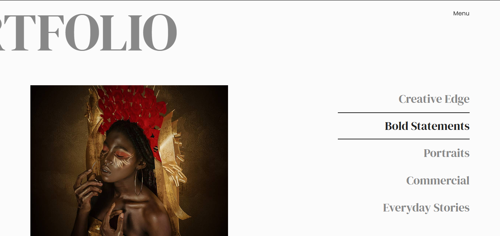

# Model Portfolio Website

## Overview

A one-page personal branding website designed for a young model to showcase her work, identity and personal brand. The site combines modern editorial design with responsive layout to highlight her story, portfolio images and contact details. Images are delivered through REST APIs for flexibility and scalability, while clean aesthetic ensures her personality and style remain the focus.

## Features

- Dynamic Portfolio Gallery - Images delivered via API for easy content management and scalability
- Responsive Layout
- Reusable Components - Modular React components for maintainable and scalable code
- Smooth Animations - GSAP used for subtle, performance-friendly interactions
- Accessibility - Semantic HTML and alt-text support for an inclusive user experience

## Tech Stack

- Frontend: React, CSS
- Animation: GSAP
- Images: REST API, Storyblok
- Deployment: Netlify

## Screenshots

## Live Site

[Visit Live Site](https://dona-udofia.netlify.app)
